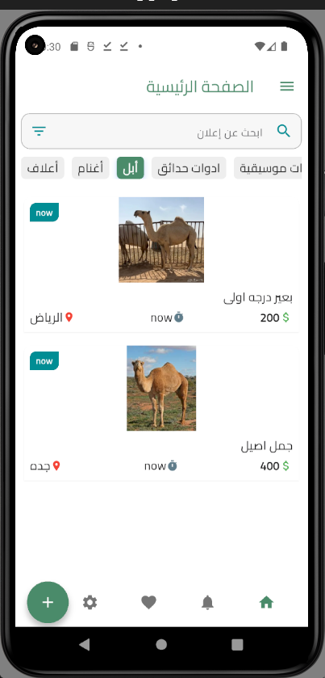
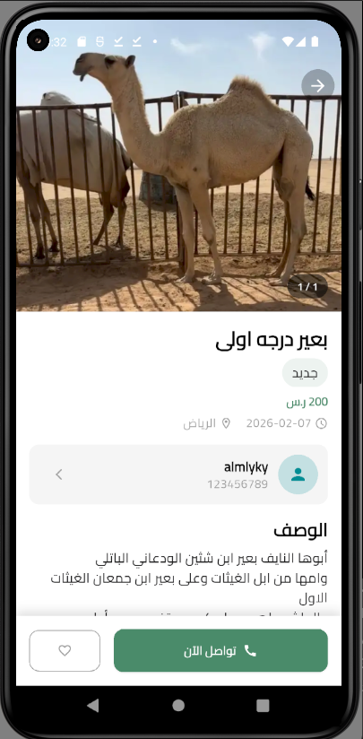
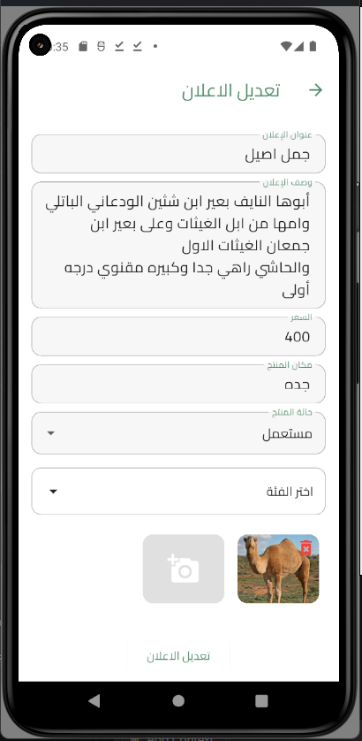
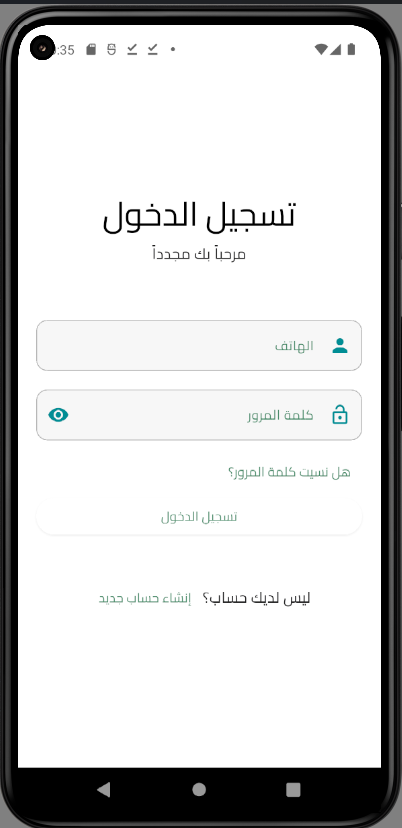

# auction_clean_arch


<!-- # structures project

```
/lib
│── main.dart # Main entry point of the application
│
├── core # Core files and essential structures
│ ├── api # API communication management
│ ├── constant # Definition of global constants like colors and routes
│ ├── localization # Language and localization management
│ ├── my_classes # General classes used in the project
│ ├── my_function # Utility functions and helpers
│ ├── services # Services such as database communication
│
├── controller # Application control and data interaction
│
├── data # Data sources
│ ├── models # Data models (Product, User, Order, etc.)
│ ├── remote # Handling data retrieval from servers or APIs
│
├── view # User Interface
│ ├── screen # Main application screens (Home, Cart, Profile, etc.)
│ ├── widget # Reusable UI components
``` -->

## 🛠️ Technologies & Libraries Used

- **Bloc** 
<!-- – For state management and navigation. -->
- **go_router**
 <!-- – For user authentication. -->
- **dio** 
<!-- – To integrate with Firebase services. -->
<!-- - **Mapbox**, **Geolocator**, **Geocoding** – For location services and map integration. -->
- **Shared Preferences** 
<!-- – For local storage and caching. -->
- **flutter_secure_storage** 
<!-- – For handling RESTful API requests. -->
- **Image Picker**
 <!-- & **Cached Network Image** – For selecting and displaying images efficiently. -->
<!-- - **flutter_dotenv**  -->
<!-- – For functional programming patterns (e.g., Either, Option).
- **Carousel Slider** & **Smooth Page Indicator** – For interactive UI sliders.
- **Lottie** – For rendering vector animations.
- **Internet Connection Checker** – For monitoring network connectivity. -->
- **flutter_dotenv** 
<!-- – For loading environment variables from a `.env` file. -->

## readme_image

<!-- ### onboarding

<p align="start">
  
  
  
  
</p> -->

<!-- ### authentication

<p align="start">
  
  
  
  
  
</p>

### user screan -->

<!-- <p align="start"> -->
  
  
  
  

<!-- </p> -->

<!-- ### dashboard screan -->

<!-- <p align="start">
  
  
  
  

</p> -->
